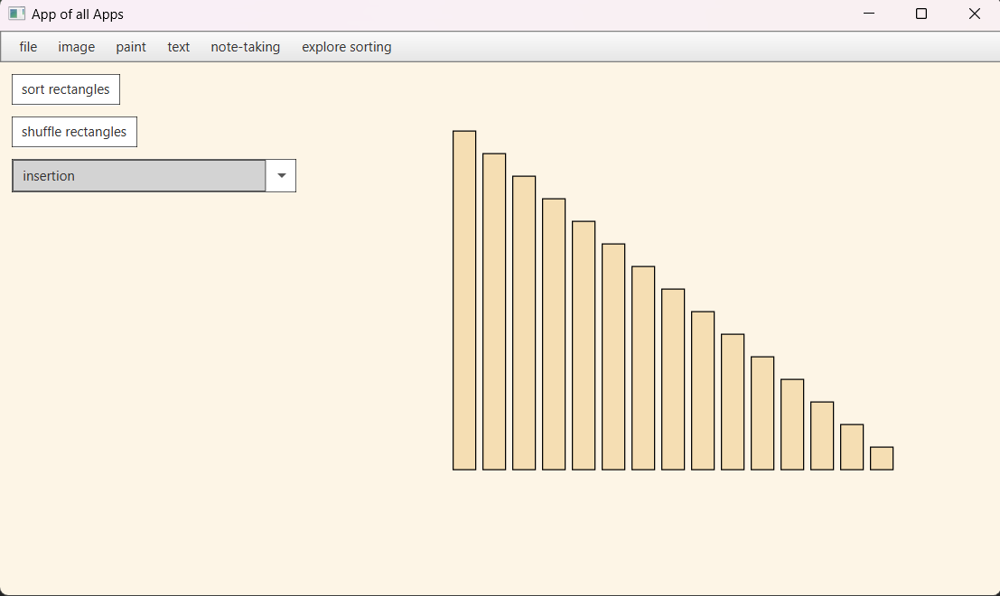
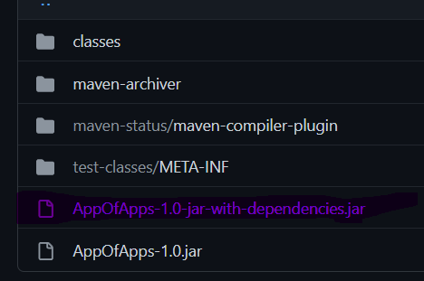

# App of Apps

### this app is all about making a as many features as possible!
* long term project that will have a variety of features talored to what I want personally in an app.
### here is one feature already added to the app:

This addition uses insertion sort to visually demonstrate a sorting alglorithm. 

It's really nothing special but I'm excited to see how far this project will go.

### what is the point?

- I really want to see how far I can take this app
- adding accessiblity to everyday tasks but keeping everything in one place.
- will test my coding stablility and help me learn more about JavaFX
  
### How do I start? why a Fat Jar?

- running the program is simple: click target and then download the jar file that says `jar-with-dependencies`.

- note: running jars like this is risky, but I haven't really learn better ways of distributing my programs, if you see me on discord please let me know what I should do

